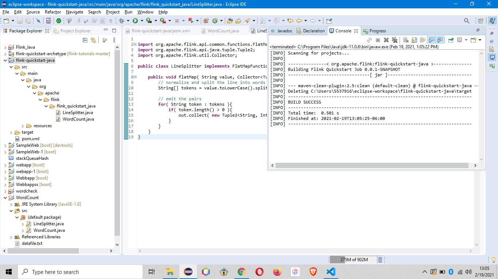

# Big Data Project- Flink-Kafka-Java

To perform operations on dataset using bigdata tools like flink and kafka.

## Group Members

<table>
<td align="center"><a href="https://github.com/Sindhujav18"><br /><sub><b>Sindhuja Valeti</b></sub></a><br /></td>

<td align="center"><a href="https://github.com/sindhurani29"><br /><sub><b>Sindh Rani Goli</b></sub></a><br /></td>

<td align="center"><a href="https://github.com/Mohanalavala"><br /><sub><b>Mohan Krishna Alavala</b></sub></a><br /></td>

<td align="center"><a href="https://github.com/vineetha1996"><br /><sub><b>Vineetha Yenugula</b></sub></a><br /></td>

<td align="center"><a href="https://github.com/dexterstr"><br /><sub><b>Tarun Sarpanjeri</b></sub></a><br /></td>

<td align="center"><a href="https://github.com/neeleshsaladi"><br /><sub><b>Neelesh Saladi</b></sub></a><br /></td>

</table>

## Mohan Krishna Alavala

## Demonstration Skill:

- I'm going to give demonstration on installation and configuration of kafka on windows machine.

## Prerequisites:

- Apache Kafka 2.13
- Zookeeper 3.4
- Maven
- Java (Java 8 or Java 11)
- IntelliJ IDE
- Powershell

## Introduction to Kafka

- You can instal kafka by clicing on the following [link](https://kafka.apache.org/downloads)
- After download is completed, you can get a tar file. Extract the tar file by using command

1. tar -xzf kafka_2.13-2.7.0.tgz
2. cd kafka_2.13-2.7.0

- After that you need to set the environment variable under KAFKA_HOME with C:\kafka_2.13-2.7.0

## Kafka set up using Maven

- To demonstrate I'm creating a project using maven in IntelliJ IDE.
- You need to slect the Maven in the
  left pane and java version on the start screen. Now click on finish
  

- Next, you need to select the name of the project, which will be the artifact id and click on finish.
  
- Now, you need to add dependencies to pom.xml file, there are some mandotory dependencies that you need to add.
  
- Demonstration Video: https://app.vidgrid.com/view/0POsipXWwQ6Q

## Basic commands to use kafka

- To start Kafka environment

---

`bin/zookeeper-server-start.sh config/zookeeper.properties`

`bin/kafka-server-start.sh config/server.properties`

## References

- https://www.tutorialspoint.com/apache_kafka/apache_kafka_installation_steps.htm
- https://kafka.apache.org/quickstart
- https://www.jetbrains.com/idea/download/#section=windows

---

## Sindhu Rani Goli

## Demonstration skill:

- Demonstration on creating produce kafka application using intelliJ idea.
- Creating topic, running and display 10 messages using powershell and intelliJ

## Prerequisites:

- Apache Kafka 2.13
- Java (Java 8 or Java 11)
- Zookeeper 3.4
- IntelliJ IDE
- Powershell
- Maven

## Steps involved:

- Installation of intelliJ idea and create a new Maven project using appropriate ID's and name of project.
- Adding plugins and required dependencies in pom.xml file which is called configuration.
- Then, logging is enabled in our kafka application.
- Create log4j2.xml file in resources. This defines a console appender and formats the output.
- We define 3 loggers root logger, console logger and application logger.
- we create a java class on right clicking on src main java node in project explorer and give class name [Producer class](https://github.com/Sindhujav18/flink-kafka-java/blob/main/HelloProducer.java) and package names.
- Then edit confiurations by selecting edit configurations and then applications in templates.
- Now the the zoomkeeper and kafka commands are run and topic name is given as well in powershell.
- Run the project in intelliJ idea and the messages are displayed.

## Output:


## Demonstration video:

Link: https://app.vidgrid.com/view/LdVb2QAG0peC

## References:
- https://www.javatpoint.com/installing-intellij-idea-in-kafka  
- http://www.siddharthpandey.net/how-to-build-a-custom-kafka-producer-application/ 

---

## Sindhuja Valeti

## Demonstration Skill:

- Creating Kafka Streams application.
- Reading a stream from kafka cluster and printing key value pair on console

## Prerequisites:

- Apache Kafka installed (2.7.0)
- JDK installed
- IntelliJ IDE installed (Community Edition : https://www.jetbrains.com/idea/download/#section=windows)

## Procedure and Commands:

- After installing IntelliJ IDE successfully, create a new Maven project with group ID, artifactID and project name.

- Add all the dependencies like kafka-clients, kafka-streams, log4j2 to integrate Kafka with intelliJ IDE.

- Now create a kafka producer java class under the package structure, the source code for producer is [kafka-producer](https://github.com/Sindhujav18/flink-kafka-java/blob/main/kafka-producer)

- The producer class contains the source code, that generates sample text messages.

- We will start reading the streams from a given topic using kafka streams java class.

- source code for kafka streams is [kafka-streams](https://github.com/Sindhujav18/flink-kafka-java/blob/main/kafka-streams)

- After creating producer and streams java files, now start the zookeeper service, kafka server and create a topic in the local host.

- Now run the producer class and Streams class in intelliJ IDE.

## Output snippet :


## Vidgrid video link :

https://app.vidgrid.com/view/JOLwn5RU57HR

## References :

- https://medium.com/@chandreshpancholi007/how-to-setup-apache-kafka-source-code-on-intellij-b204966d7c2

- http://www.siddharthpandey.net/how-to-build-a-custom-kafka-producer-application/

---

## Vineetha Yenugula

## Demonstration Skill:

This project is use a simple Flink job to show how to integrate Apache Kafka to Flink using the Flink Connector for Kafka.

## Overview Of Apache Flink and Apache Kafka:

- Apache Flink is a stream processing framework that can be used easily with Java.
- Apache Kafka is a distributed stream processing system supporting high fault-tolerance.

## Flink Usage:

Apache Flink allows a real-time stream processing technology. The framework allows using multiple third-party systems as stream sources or sinks.
In Flink – there are various connectors available :

- Apache Kafka (source/sink)
- Apache Cassandra (sink)
- Amazon Kinesis Streams (source/sink)
- Elasticsearch (sink)
- Hadoop FileSystem (sink)
- RabbitMQ (source/sink)
- Apache NiFi (source/sink)
- Twitter Streaming API (source)

## Kafka Usage:

In short, Kafka is used for stream processing, website activity tracking, metrics collection and monitoring, log aggregation, real-time analytics, CEP, ingesting data into Spark, ingesting data into Hadoop, CQRS, replay messages, error recovery, and guaranteed distributed commit log for in-memory computing (microservices).

### Flink-Kafka-Interaction:

<p align="center">

 </p>
 
## Prerequisites
- Flink 
- Kafka
- Eclipse (To execute java code)
- And should know how to run commands in command line interface.

## Start Kafka and Create Topic

In the kafka installed directory need to opn the administator and run these commands.

Kafka uses ZooKeeper, if you do not have Zookeeper running, you can start it using the following command:

```bash
.\bin\windows\zookeeper-server-start.bat .\config\zookeeper.properties
```

Start a Kafka broker by running the following command in a new terminal:

```bash
.\bin\windows\kafka-server-start.bat .\config\server.properties
```

In another terminal, run the following command to create a Kafka topic called `flink-kafka-interaction`:

```bash
.\bin\windows\kafka-topics.bat --zookeeper localhost:2181 --replication-factor 1 --partitions 1 --create --topic flink-kafka-Interaction
.\bin\windows\kafka-topics.bat --zookeeper localhost:2181 --list
```

## Build and Run the Application

In the project folder:

```
$ mvn clean package
```

And run the Flink Consumer:

```
$ mvn exec:java -Dexec.mainClass=com.grallandco.demos.ReadFromKafka
```

and Producer:

```
mvn exec:java -Dexec.mainClass=com.grallandco.demos.WriteToKafka
```

You should see messages printed in the Consumer console.

You can run this application directly in a Flink cluster.

## output images:

<p align="center">

 </p>

## vid-grid video:

- [Vid_Grid_Video_Link](https://use.vg/2GP7w3)

### Resources:

- [Apache_Flink_Kafka_Guide](https://www.ververica.com/blog/kafka-flink-a-practical-how-to)
- [Apache_Flink_Kakfa_connection](https://ci.apache.org/projects/flink/flink-docs-stable/dev/connectors/kafka.html)

---

## Tarun Sarpanjeri

### Demonstartion Skill:

- I would like to explain Flink and its configuration and to verify the installation on windows.
  <br>

### Pre-Requisites:

- Apache Flink Installed (1.12.1)
- Java Installed (Java8 or Java11)
- Eclipse IDE installed
<!-- * NetCat Installated: [https://nmap.org/download.html](https://nmap.org/download.html) -->

### Introduction to Flink

- Apache Flink was founded by Data Artisans company and is now developed under Apache License by Apache Flink Community.
- Apache Flink is the open source, native analytic database for Apache Hadoop.
- Apache Flink is an Open source stream processing framework for distributed, high performance data streaming application.
- Flink also provides batch processing, graph processing, Itearative proccessing for Machine learning applications.
- Flink offers substantially higher processing speeds to spark and hadoop.
- Flink provides low latency and high throughput.

### Flink download process

- Go to [apache Flink](https://flink.apache.org/downloads.html) and select the stable version and download it.
- open powershell and untar the downloaded file using `tar -xvf <filename.tgz>`.
- Set up system variable `FLINK_HOME` and configure it to the `C:\flink-1.12.1` folder location and configure the path accordingly and also update the same in system path too.

### Flink set up using Eclipse.

- Using Eclipse create a new Java project.
  
- You can name the project as WordCount or with any name you choose.

- Add the following JAR in the build path. You can find the jar files in the lib directory in flink directory.
  
- Make a Class WordCount and Line SPlitter
- Here I am splitting the word and chcecking how many times it occurred in text.
- Before running application maven build must be done.
  
- Maven test must also be done .
  
- Run the java application
  
  
  ### Demonstration Video 
  - [VidGrid](https://use.vg/IdBwnw)

## Neelesh Saladi

- Link to my Readme Repo where I explained about the configuring my Flink in my laptop.
- [Neelesh Saladi Repo](https://github.com/neeleshsaladi/my-flink-project/blob/main/README.md)
